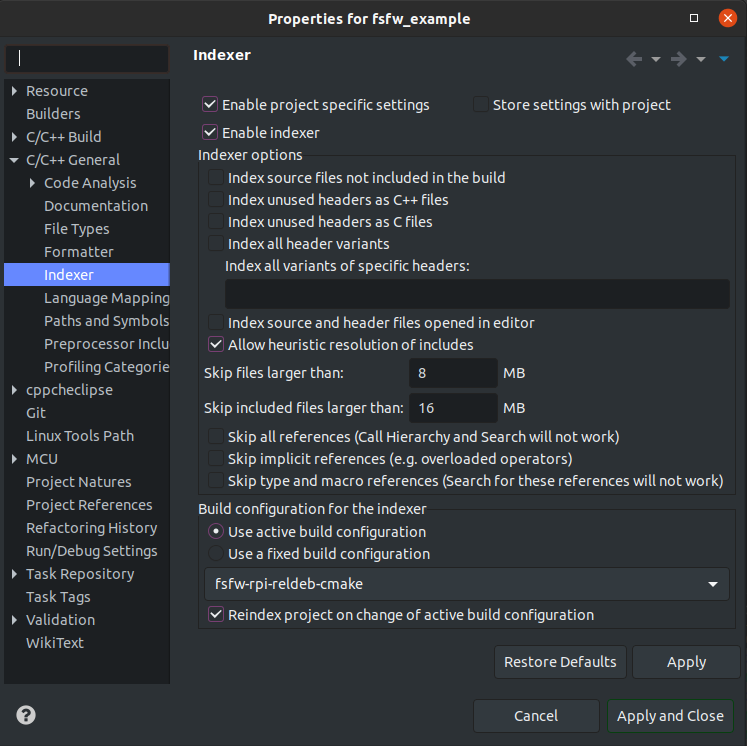
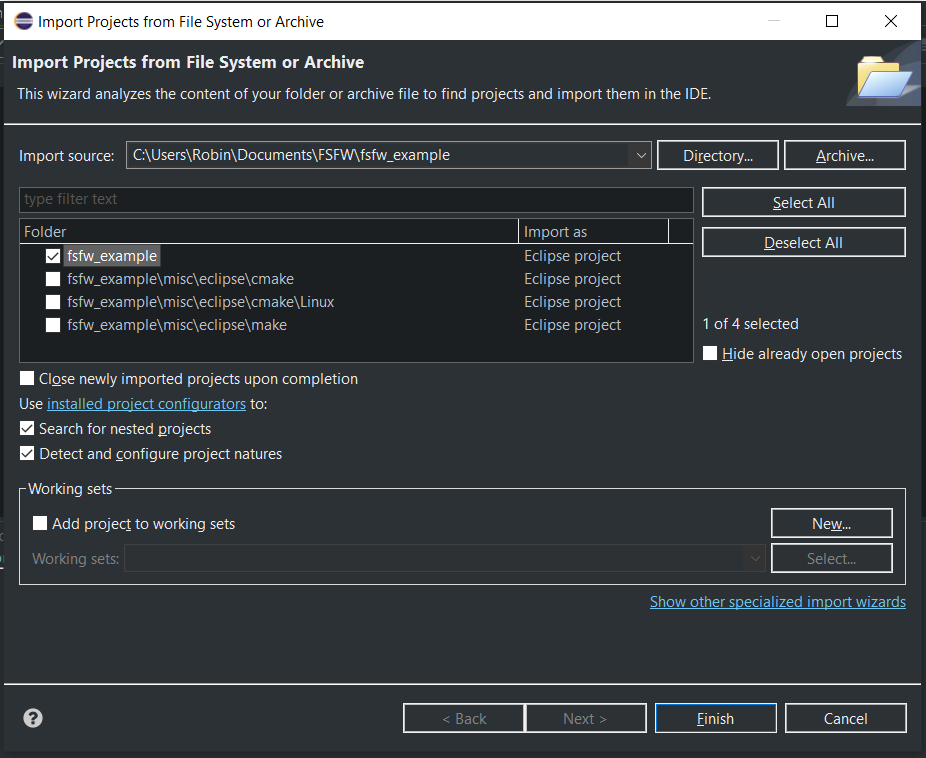
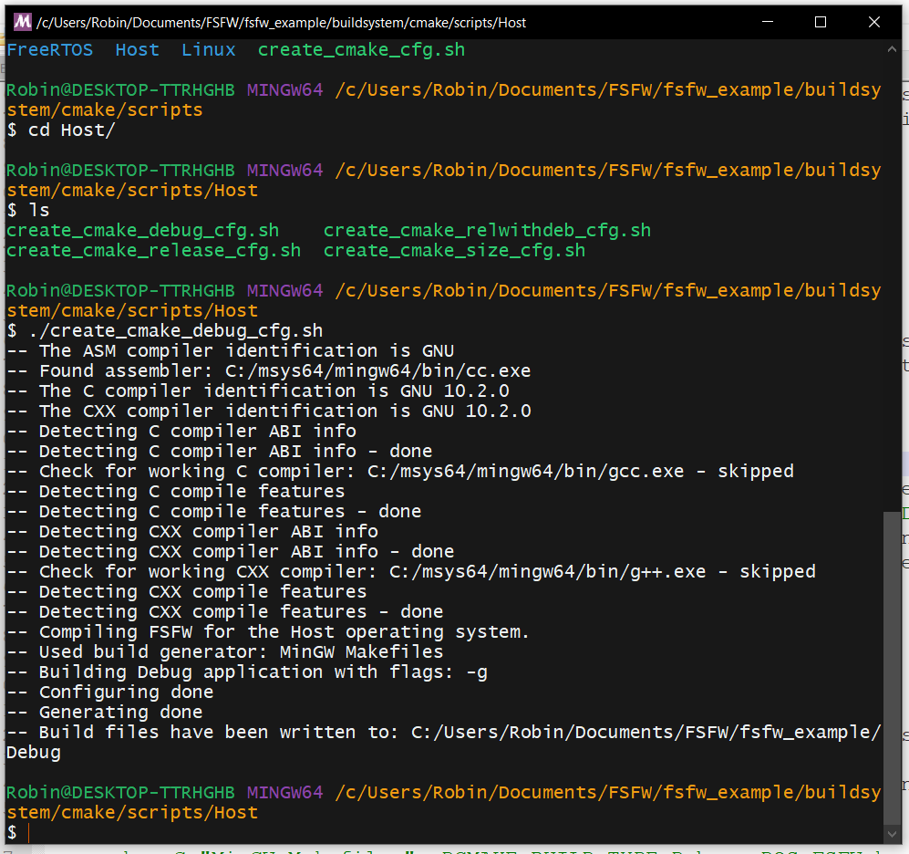
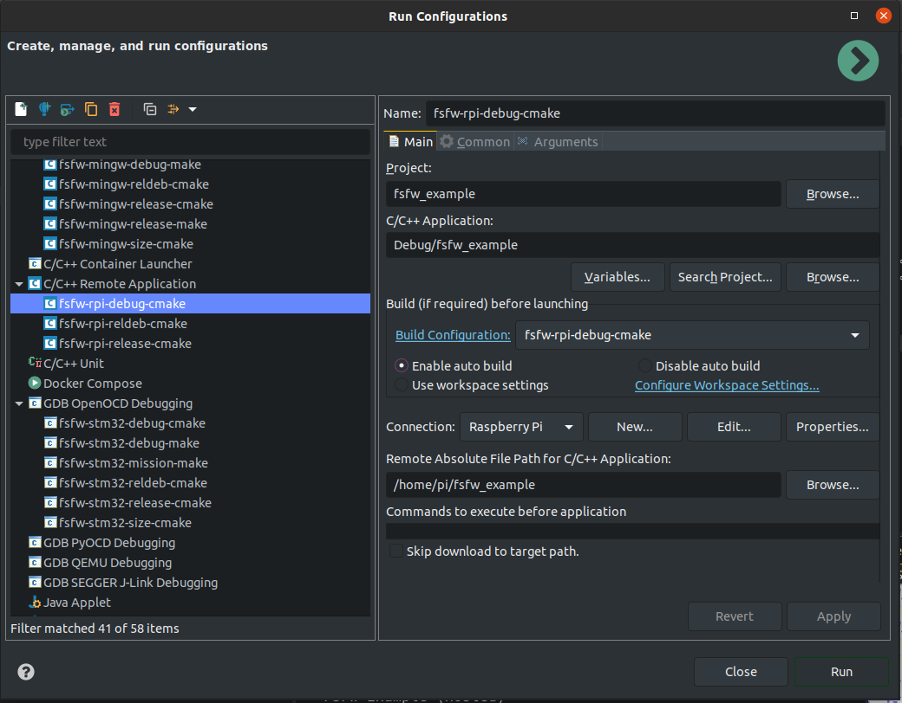
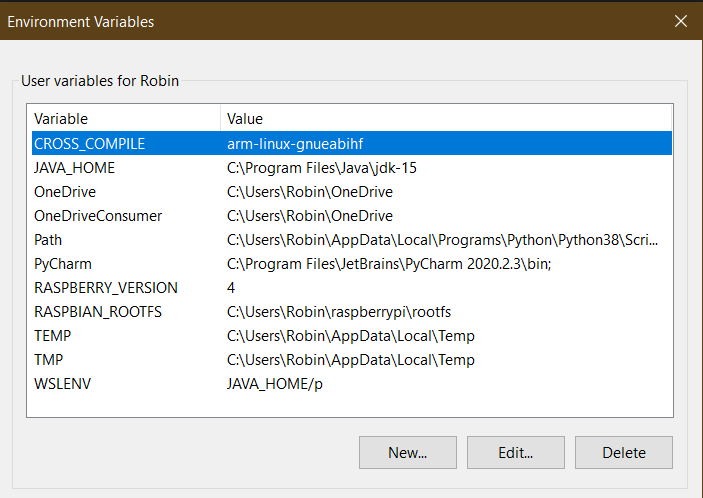

<sub><sup>Image taken from [Eclipse website](https://www.eclipse.org/artwork/)</sup></sub>

Eclipse is a general purpose IDE, which was initially developed for Java
but has evolved to be used for C/C++ as well. It is the recommended IDE
to develop Software with the FSFW because it is cross-platform, provides
useful features like an indexer and can be configured with moderate effort
to use the Make and CMake build systems.

## Setting up Eclipse - General

Eclipse project files and launch configurations were provided to have a starting 
point for application development with Eclipse. It is recommended to use those 
files and delete unneeded run configurations manually.
There are separate project files to either use the Makefiles or CMake.

1. Install [Eclipse for C/C++](https://www.eclipse.org/downloads/packages/) 
   using the installer. Install the Eclipse MCU plugin
   for the STM32 and Raspberry Pi example by going to Help &rarr; Eclipse 
   Marketplace and searching and installing the plugin

2. For the STM32, the ARM toolchain (and Windows Build Tools on Windows) should have been 
   installed previously. Go to Window &rarr; Preferences &rarr; MCU &rarr; Global ARM Toolchain 
   and Windows Build Tools. Packages installed with xpm should be recognized automatically.
   
3. Setting up the indexer: It is recommended to use the separate indexers for 
each run configurations. Right click on the project folder in the tree view, 
go to Properties &rarr; C/C++ General &rarr; Indexer and set the indexer as shown below.

   

4. Cross-Compiling: In general, the provided project configurations should set up 
   the cross compiler properly. However, if there are issues, the user should 
   check whether the compilers are set up properly.
   
   Right click on the project folder in the tree view, go to 
   Properties &rarr; C/C++ Build &rarr; Tool Chain Editor and set the correct 
   editor. Then go to Properties &rarr; C/C++ Build &rarr; Settings and check 
   whether the cross-compiler paths are correct.


## Setting up Eclipse for a hosted CMake projects

1. Copy the  files `.project` and `.cproject` inside the misc/eclipse/make folder 
   into the root of the cloned folder. This will add all build configurations.
   
   ```sh
   cd fsfw_example
   cp misc/eclipse/cmake/.project .
   cp misc/eclipse/cmake/.cproject .
   ```
   
2. Import the project now by going to File &rarr; Import &rarr; Existing Projects and selecting the cloned folder. 
   Only check the root folder, Eclipse will try to import every folder which contains
   `.project` or `.cproject` files!
   
   

3. Set up the build folders. Helper scripts have been provided to perform this 
   task and have a starting point, but a valid Python 3 installation is required for them to work. 
   For example, to create the build folder `Debug` and build the software 
   with the FSFW Host OSAL on Windows or Linux, perform the following steps in the MinGW64 
   command line or Linux terminal after navigating into the cloned example folder:
   
   ```sh
   cd buildsystem/cmake/scripts/Host
   ./create_cmake_debug_cfg.sh
   ```
   
   The shell script can also be run by double clicking it in Windows as long as it is executed
   by the MinGW terminal. This shell script will first create a new Debug folder (and delete the old one)
   and then execute the following command in the build folder on Windows
   
   ```sh
   cmake -G "MinGW Makefiles" -DCMAKE_BUILD_TYPE=Debug -DOS_FSFW=host
   ```
   
   or the following command on Linux:
   
   ```sh
   cmake -G "Unix Makefiles" -DCMAKE_BUILD_TYPE=Debug -DOS_FSFW=host
   ```
   
   For example, the execution of the script in MinGW64 on Windows should show the
   following output:
   
   
   
4. The build system is now ready to be used in Eclipse. Select the `fsfw-mingw-debug-cmake` (Windows)
   or `fsfw-linux-debug-cmake` (Linux) launch configuration
   in Eclipse and press the hammer button to build the software or the bug button to debug the 
   software for a host machine. This will invoke `cmake --build . -j` in the respective build 
   folders to build the software.
   
## Seting up Eclipse for Raspberry Pi projects - Remote Application

Eclipse is configured to assume that the toolchain is located in `/opt/cross-pi-gcc/bin` and 
will deduce settings and compiler specs automatically (e.g. for the indexer) if the provides build 
and launch configurations are used. Adapt the toolchain  path accordingly if is installed 
somewhere else.


Follow steps one and two of the previous section. 

3. Set up the run configuration properly by setting up a SSH connection with 
   your Raspberry Pi. Go to Run &rarr; Debug Configurations.., look for the 
   `C/C++ Remote Application` section and click on one of the configurations 
   provided for the Raspberry Pi. A new SSH connection should be set up here. 
   The following image shows an example

       

4. Set up the build folders if this was not done already. 
   We are going to do this with the script
   
   ```sh
   cd buildsystem/cmake/scripts/RPi
   ./create_cmake_debug_cfg.sh
   ``` 

5. The build system is now ready to be used in Eclipse. 
   Select the `fsfw-rpi-debug-cmake` launch configuration and press the run or 
   debug button in the top panel on the right side to run or debug the application. 
   If there are issues, ensure that the Launch Configuration uses the correct 
   SSH settings to connect to the Raspberry Pi. 

On Windows, MinGW Makefiles are used for the cross-compilation process, but Eclipse will only 
have the Windows environmental variables cached. This can lead to issues with the CMake build if it
is configured in MinGW64. It is recommended to add the `RASPBIAN_ROOTFS` and the `RASPBERRY_VERSION`
variable to the Windows environmental variables.

The following picture shows an example:



Alternatively, you can also add them to the Eclipse environmental variables in Properties &rarr;
C/C++ Build &rarr; Environment

## Setting up Eclipse for Raspberry Pi projects - TCF agent

Alternatively, the [TCF agent](https://wiki.eclipse.org/TCF) can be used 
as a more generic and powerful tool to perform remote debugging.

1. Install the TCF agent plugin in Eclipse from the 
   [releases](https://www.eclipse.org/tcf/downloads.php). Go to 
   Help &rarr; Install New Software and use the download page, for 
   example https://download.eclipse.org/tools/tcf/releases/1.6/1.6.2/ to search 
   for the plugin and install it.

2. Go to Window &rarr; Perspective &rarr; Open Perspective and open the 
   **Target Explorer Perspective**. Here, the Raspberry Pi should show up if 
   the TCF agent has been set up on the Raspberry Pi as specified 
   [here](https://wiki.eclipse.org/TCF/Raspberry_Pi) or in the 
   respective [README](README-rpi.md#top). Connect to it.

3. Create a new **TCF Remote Application**. No launch configuration has 
   been provided because the IP address can change regularly.

 - Create a new the configuration by pressing the cogs button at the top or 
   going to Run &rarr; Debug Configurations &rarr; Remote Application and
   creating a new one there. 

 - Select the TCF connection, the correct image in the main tab (it might be 
   necessary to send it the the Raspberry Pi manually once) and file transfer properties

 - It is also recommended to link the correct Eclipse project. 

After that, comfortable remote debugging should be possible with the Debug button.

## Setting up Eclipse for the Makefile projects

The Makefiles are not maintained anymore and it is recommended to use the 
CMake build configurations instead.

1. Copy the  files `.project` and `.cproject` inside the misc/eclipse/make folder 
   into the root of the cloned folder. This will add all build configurations.
   Configurations which are not required can be deleted manually.
   
   ```sh
   cd fsfw_example
   cp misc/eclipse/make/.project .
   cp misc/eclipse/make/.cproject .
   ```
   
2. Import the project now by going to File &rarr; Import &rarr; Existing Projects and selecting
   the cloned folder.
   
3. It should now be possible to build and debug the program by selecting the 
   correct launch configuration in the top panel and hitting the hammer or debug button.
